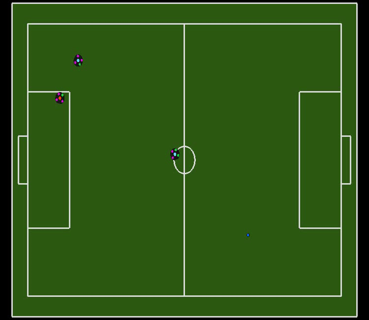

# rsoccer_rl

Welcome to the rSoccer RL project! This repository contains Deep Deterministic Policy Gradient (DDPG) model to train an agent to done the go-to-ball task in the rSoccer gym environment. rSoccer Gym is an open-source framework to study Reinforcement Learning for SSL and IEEE VSSS competition environment.
<p align="center">

</p>

## Installation
To get started with this project, you need to install the rSoccer gym environment first. Follow these steps:

1. Clone the rSoccer gym environment repository:
```bash
git clone https://github.com/ErfanFathi/rSoccer.git
cd rSoccer
pip install -e .
```

2. Clone this repository:
After installing the rSoccer environment, you can clone this repository and use the provided scripts to train and evaluate RL agents.
```bash
git clone https://github.com/ErfanFathi/rsoccer_rl.git
cd rsoccer_rl
```

## Training
```bash
# First get the help message to see the available options
python main.py --help
# Train an agent
python main.py --save_model
```

## Testing
```bash
# Test the trained agent
python test.py
```

## Contributing
Contributions are welcome! If you have any improvements or bug fixes, please open an issue or create a pull request.

## Final Note
This project is still under development. If you have any questions or suggestions, feel free to contact me at fathierfan97@gmail.com.